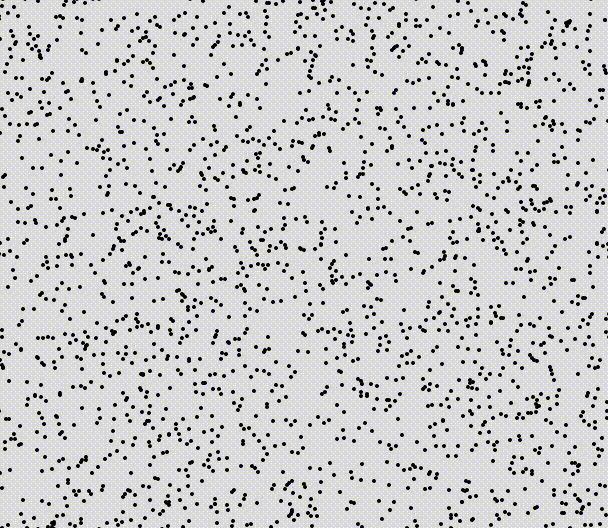
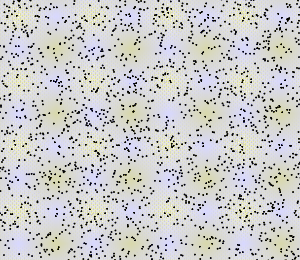
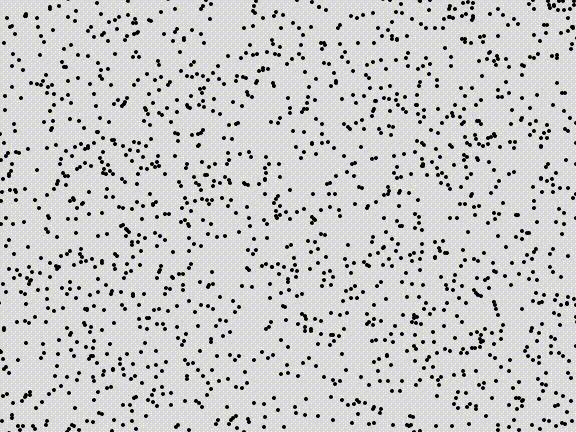
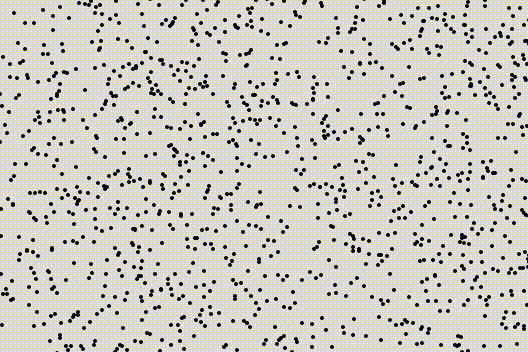

# leaflet-spotlight

A Leaflet plugin for creating a "highlight" effect on features near the user's cursor.

## Dependencies

* `Leaflet >= 1.1.0`
* `turf.js >= 5.1.6`

## Installation

With npm:

```
npm i leaflet-spotlight
```

Manually:

Import the library into your HTML document. Make sure that it is imported AFTER Leaflet and turf.js

```
<script src="src/leaflet-spotlight-extension.min.js"></script>
```

## Examples

Detailed examples for various use cases can be found in the
[examples](https://github.com/iboates/leaflet-spotlight/tree/master/examples) folder.

<p align="center">


A simple spotlight highlighting all points [(Demo)](https://iboates.github.io/examples/00_simple/index) [(Source)](https://github.com/iboates/leaflet-spotlight/tree/master/examples/00_simple) [(Toggleable version demo)](https://iboates.github.io/examples/00_simple/index) [(Toggleable version source)](https://github.com/iboates/leaflet-spotlight/tree/master/examples/01_toggleable)
</p>

<p align="center">


A (toggleable) simple marker-based spotlight highlighting all points [(Demo)](https://iboates.github.io/examples/01_toggleable_marker/index) [(Source)](https://github.com/iboates/leaflet-spotlight/tree/master/examples/01_toggleable_marker)
</p>

<p align="center">


A (toggleable) pair of spotlights, each of which selectively highlights points based on their attributes [(Demo)](https://iboates.github.io/examples/02_multiple_spotlights/index) [(Source)](https://github.com/iboates/leaflet-spotlight/tree/master/examples/02_multiple_spotlights)
</p>

<p align="center">


A (toggleable) pair of marker-based spotlights, each of which selectively highlights points based on their attributes [(Demo)](https://iboates.github.io/examples/02_multiple_spotlights_marker/index) [(Source)](https://github.com/iboates/leaflet-spotlight/tree/master/examples/02_multiple_spotlights_marker)
</p>

## How it works (generally)

The plugin enables an `L.Map` object to manage new `L.Spotlight` objects, which are linked to an `L.Layer` object in the map. You as the developer must define a function which receives a receives an `L.latlng` (which will be the user's mouse cursor), and constructs from it a `turf.js` Polygon. You also must specify either an `L.Style` object or a function which returns one, which will indicate how to draw the features which are contained within the spotlight area. You can also specify the style of the spotlight on the map itself.

See the [javascript for the simple example](https://github.com/iboates/leaflet-spotlight/blob/master/examples/00_simple/init.js) for a detailed walkthrough.
